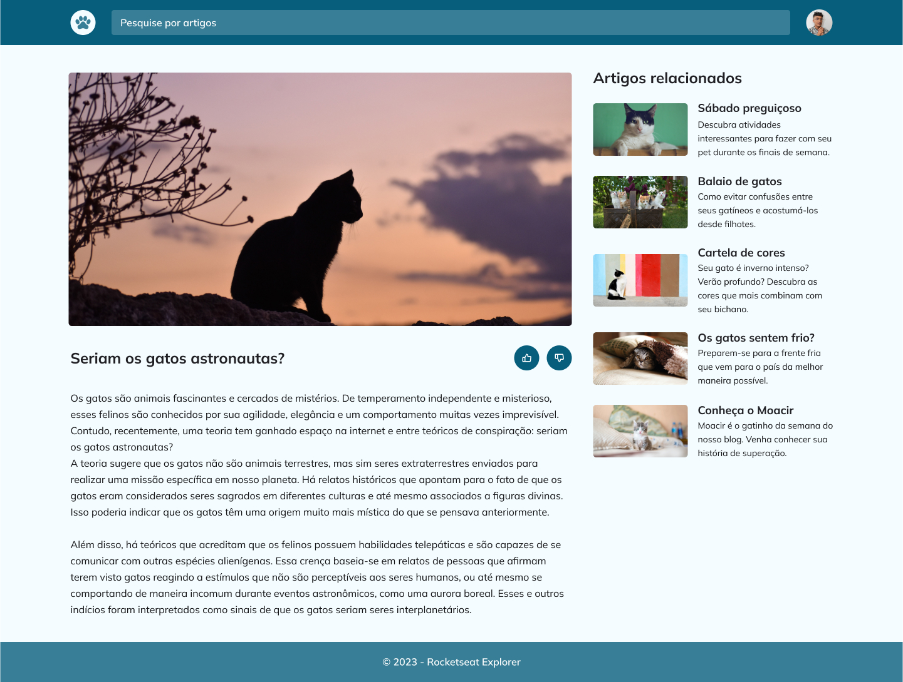

<h1 align="center"> Blog de Gatos</h1>

Curso Explorer, iniciando a missão.

  <a href="#-tecnologias">Tecnologias</a>&nbsp;&nbsp;&nbsp;|&nbsp;&nbsp;&nbsp;
  <a href="#-projeto">Projeto</a>&nbsp;&nbsp;&nbsp;|&nbsp;&nbsp;&nbsp;
  <a href="#-layout">Layout</a>&nbsp;&nbsp;&nbsp;|&nbsp;&nbsp;&nbsp;
  <a href="#-licença">Licença</a>

 

  

## 🚀 Tecnologias

Esse projeto foi desenvolvido com as seguintes tecnologias:

- HTML e CSS
- Git e Github
- Responsividade
- Figma

## 💻 Projeto

Primeiro projeto do curso explore. 

## 🔖 Layout

Você pode visualizar o layout do projeto através [DESSE LINK](<https://www.figma.com/file/BGsSQhfr65dfJTF3VHUzTB/Explorer---Projeto-01-(Copy)?node-id=0%3A1&t=dB6vVC8s7e6mFezu-0>). É necessário ter conta no [Figma](https://figma.com) para acessá-lo.

## Licença

Esse projeto está sob a licença MIT.

---

Feito com ♥ by Anny Mello 